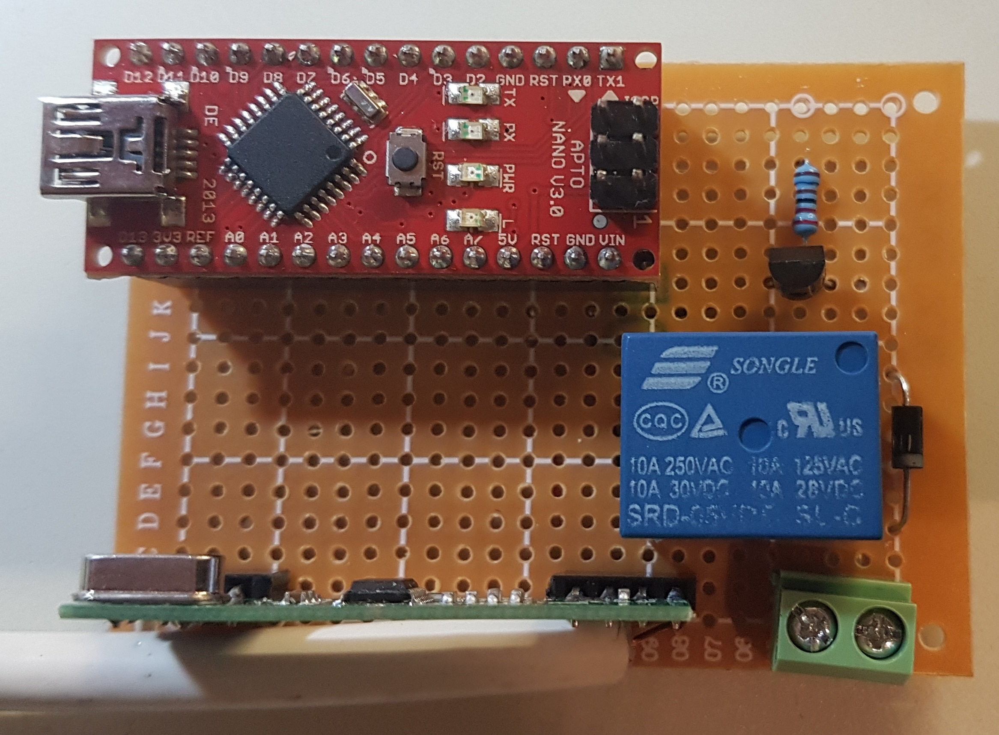
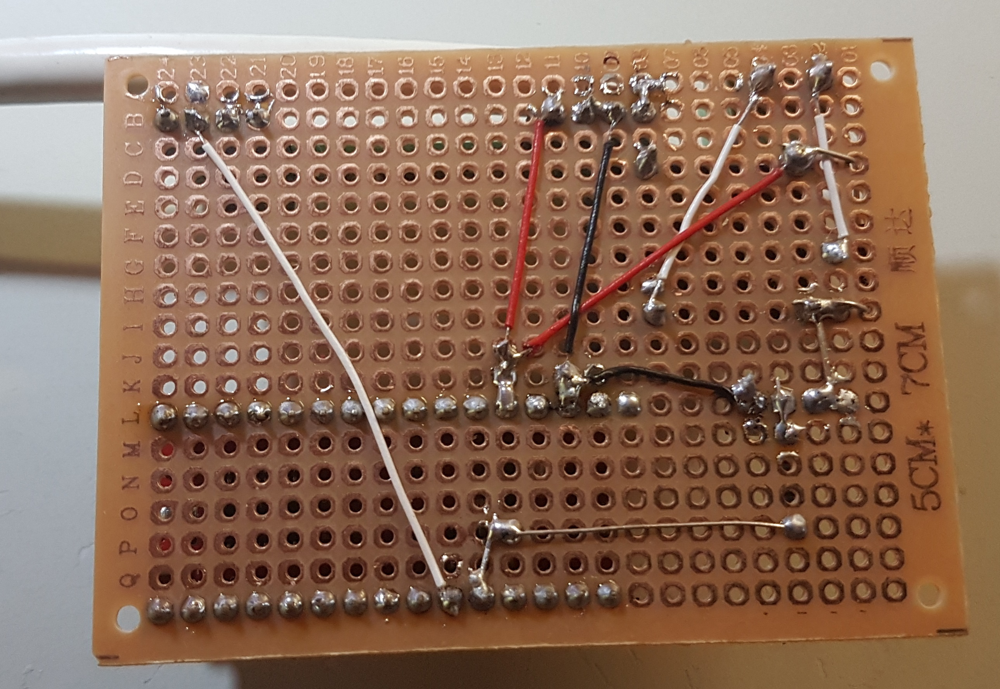
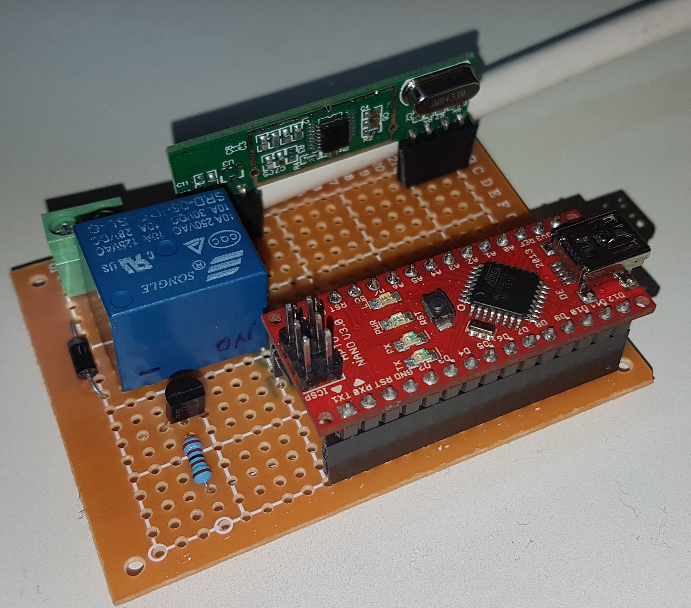
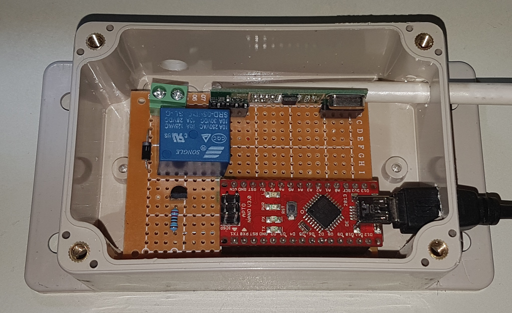

# Arduino Garage Door Receiver

## Problem
So the motor of my old garage door lifter burned out. Since it is no longer made and used replacement motors cost as much as a new lifter, I bought a new one.
The new one of course uses a different scheme for 433Mhz remote controle, rolling keys and stuff. I have a bunch of old remotes from the old system though, also I implemented a solution for controling the garage door lifter via my home automation system using a 433MHz transmitter. I want to keep using the old remotes and the home automation system.

## Solution

The new garage door lifter [Hörmann Liftronic 500, 433MHz, 2 x RSC2, Ausf D, 4511450](https://www.amazon.de/gp/product/B00520C7M2) has a pair of contacts where you can connet a switch to open/close the door. I close these contacts with a relay controlled by an arduino equipped with a 433MHz receiver that listens for the codes of the old remotes.

## Build

* Breadboard setup with a BC547 transistor, a 2.2k base resistor and a srd-05vdc-sl-c 5V relay.

* Perfboard build top view including including a flyback diode (thanks Hans)

* Perfboard build bottom view

* Perfboard build perspective view

* In a little case

